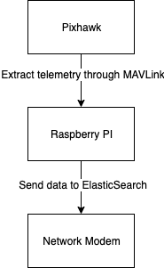
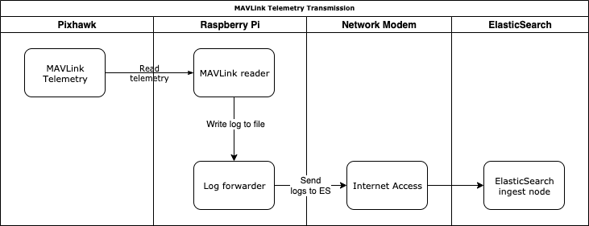

# 5G!Drones Telemetry Transmission Proof of Concept

## Architecture

The system consists of three physical components: Pixhawk, Raspberry Pi and a Network Modem 
(which can be substituted or omitted in case Raspberry is connected to internet by other means,
and later replaced by 5G network modem):

### High-level diagram

### More detailed sequence diagram

## MAVLink reader application

### Implementation proposal

1. Physically connect Pixhawk to Raspberry Pi for transmitting through MAVLink  
2. Create an application (most likely a Python Application) that connects to Pixhawk and reads telemetry
3. Store telemetry in a file as JSON

## Log Forwarder application

### Implementation proposals

#### Option A

Install and run Filebeat on raspberry. Should be easiest to integrate with ElasticSearch.

#### Option B

Create an application that tails the log and sends events to ElasticSearch via HTTP(S). 
